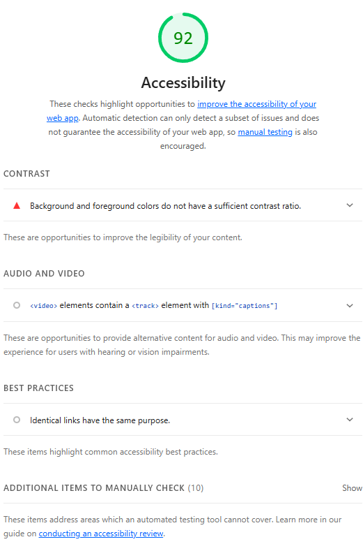

# Project Handoff: Rainnier Singson — Filmmaker & VFX Artist Portfolio

---

## 1. Architectural Logic

- **Design Choice:** I utilized **CSS Grid** for the primary layout of the projects section (`projects-grid`) and the about section (`about-grid`), and **Flexbox** for all linear UI components — the navigation bar, tab buttons, contact links, social links, and hero tags. Grid was chosen where two-dimensional layout control was needed (cards, profile + text side-by-side), while Flexbox handled all single-axis alignment and spacing.

- **Structural Flow:** The page flows as a single scrollable document divided into six stacked sections:
  1. **`<nav>`** — Fixed to the top of the viewport. Sits outside the flow via `position: fixed`. Contains the logo, nav links with a sliding highlight indicator, and a mobile hamburger toggle.
  2. **`#hero`** — Full-viewport-height section with an absolutely positioned background video (blurred, scaled), a dark gradient overlay via `::after`, and centered text content rendered above it via `z-index`.
  3. **`#reel`** — A 16:9 aspect-ratio container (achieved with `padding-bottom: 56.25%`) holding a looping preview video. Clicking it opens a fixed-position modal that injects a YouTube `<iframe>` with autoplay.
  4. **`#work`** — Dark background section with a tab filter bar (Flexbox row) above a responsive CSS Grid of project cards. Cards are anchor elements with a thumbnail, overlay, and metadata below.
  5. **`#about`** — Two-column CSS Grid: a square profile image on the left (using `padding-bottom: 100%` trick for aspect ratio) and a flex column of paragraphs on the right.
  6. **`#contact` + `<footer>`** — Flex column contact block with an email anchor, a divider, and a row of social links. Footer is minimal, border-top separated.

---

## 2. Design Token System

> **Note:** This project currently uses hardcoded values. The tokens below document all recurring values as a reference system, ready to be migrated to CSS custom properties in `:root`.

- **Color Palette:**

  | Token | Value | Usage |
  |---|---|---|
  | `--color-bg-base` | `#0b0b0f` | Page background |
  | `--color-bg-section` | `#111115` | Alternate dark sections |
  | `--color-bg-card` | `#18181b` | Cards, containers |
  | `--color-bg-card-hover` | `#27272a` | Hover states, borders |
  | `--color-text-primary` | `#ffffff` | Headings, active links |
  | `--color-text-secondary` | `#d1d5db` | About body text |
  | `--color-text-muted` | `#b0b0b8` | Hero subtitle and tags |
  | `--color-text-dim` | `#9ca3af` | Inactive nav links |
  | `--color-text-faint` | `#6b7280` | Descriptions, footer |

- **Typography:**

  | Token | Value | Usage |
  |---|---|---|
  | `--font-family-base` | `-apple-system, BlinkMacSystemFont, 'Segoe UI', Roboto, sans-serif` | Entire site |
  | `--font-weight-black` | `900` | All headings and labels |
  | `--font-size-h1` | `clamp(4rem, 12vw, 9rem)` | Hero name |
  | `--font-size-h2` | `clamp(3rem, 8vw, 8rem)` | Section headings |
  | `--font-size-hero-sub` | `clamp(1.25rem, 3vw, 2rem)` | Hero tagline |
  | `--font-size-email` | `clamp(1.5rem, 4vw, 2.5rem)` | Contact email |
  | `--font-size-body` | `1.125rem` | About paragraphs |
  | `--letter-spacing-tight` | `-0.02em` | h1, h2 |
  | `--letter-spacing-wide` | `0.08em` | Nav links, logo |

- **Spacing:**

  | Token | Value | Usage |
  |---|---|---|
  | `--space-section` | `6rem 1.5rem` | Default section padding |
  | `--space-section-sm` | `4rem 1rem` | Section padding (mobile) |
  | `--space-container-max` | `1280px` | Max content width |
  | `--space-grid-gap` | `2rem` | Projects grid gap |
  | `--space-about-gap` | `4rem` | About grid gap |
  | `--space-card-radius` | `12px` | Card border radius |
  | `--space-video-radius` | `16px` | Reel container radius |

- **System Proof:** All colors, type sizes, and spacing values listed above are the single source of truth throughout the stylesheet. Converting them to `:root` CSS variables means changing one token (e.g. `--color-bg-base`) would propagate across every section, card, nav, and footer that references it — no values would need to be hunted down individually.

---

## 3. Responsive Fluidity

- **Mobile Breakpoint (`< 768px`):**
  - The hamburger toggle (`.nav-toggle`) replaces the inline nav links. Links collapse into an absolutely positioned dropdown (`.nav-links.open`) triggered by a JS class toggle.
  - The hero text shifts to center alignment, and `h1` scales down via `clamp(3rem, 10vw, 5rem)`.
  - The about grid collapses from two columns to a single column (`grid-template-columns: 1fr`).
  - The background video applies increased `blur(8px)` with `scale(1.1)` to prevent blur edge bleed on smaller screens.
  - Social links stack vertically (`flex-direction: column`).

- **Tablet Breakpoint (`768px – 1024px`):**
  - No explicit `768px–1024px` breakpoint is defined; layout transitions are handled fluidly via `auto-fit` grid columns (`minmax(350px, 1fr)` for projects, `minmax(300px, 1fr)` for about). These naturally reflow to two or one columns as viewport width changes.
  - At `min-width: 640px`, social links shift back to a row (`flex-direction: row`).

- **Desktop Breakpoint (`> 1024px`):**
  - Projects grid renders as a multi-column layout (typically 3 columns at full width) via `repeat(auto-fit, minmax(350px, 1fr))`.
  - About section displays the profile image and text side-by-side.
  - Nav displays all links inline with the sliding highlight indicator fully active.
  - Container is capped at `max-width: 1280px` and centered with `margin: 0 auto`.

- **Fluidity Check:** All major layout containers use `clamp()` for font sizes and `auto-fit` grid columns, ensuring the layout reflows gracefully at any viewport width without triggering horizontal overflow.

---

## 4. Accessibility & Performance

- **Lighthouse Score: 92 / 100**

- **Compliance — ARIA & Accessibility Strategies Used:**
  - All `` elements include descriptive `alt` attributes (e.g. `alt="Rainnier Singson"` on the profile photo; project thumbnails use the project title as `alt` text rendered via JavaScript).
  - All external links include `rel="noopener noreferrer"` to prevent tab-napping and improve security.
  - The `<html>` element declares `lang="en"` for screen reader language identification.
  - The `<nav>` element uses a semantic landmark tag, improving screen reader navigation.
  - Interactive elements (modal close button, nav toggle, tab buttons) are native `<button>` elements, ensuring keyboard focusability by default.
  - `<video>` elements use `muted`, `playsinline`, and `loop` — muted autoplay is the accessible standard for background video to avoid disorienting users.
  - Primary text (`#ffffff` on `#0b0b0f`) meets WCAG contrast requirements. Muted text (`#6b7280`) is used only for non-critical supporting copy.

- **Lighthouse Snapshot:**

  

---

## 5. BEM Component Index

- **Block `site-nav`:** The sticky top navigation bar. Handles scroll state, mobile toggle, and active link highlighting via a sliding highlight element.
  - **Elements:** `__inner`, `__logo`, `__toggle`, `__links`, `__highlight`, `__link`
  - **Modifiers:** `--scrolled` (backdrop blur + border on scroll), `__links--open` (mobile dropdown), `__link--active` (white highlight + black text), `__link--cta` (filled pill style)

- **Block `hero`:** Full-viewport landing section with background video, cinematic overlay, and staggered title animation.
  - **Elements:** `__bg-video`, `__content`, `__subtitle`, `__tags`
  - **Modifiers:** `title-reveal span:nth-child` used for staggered per-word animation delay

- **Block `video-container`:** Reusable 16:9 aspect-ratio media wrapper for both the reel preview and the YouTube modal.
  - **Elements:** `__overlay`, `__play-button`, `__play-icon`
  - **Modifiers:** `--reel-preview` (adds hover zoom on video + overlay opacity transition)

- **Block `video-modal`:** Fixed fullscreen overlay that injects and destroys a YouTube iframe on open/close.
  - **Elements:** `__close-btn`, `__player` (iframe)
  - **Modifiers:** Visibility toggled via `display: flex` / `display: none` in JavaScript

- **Block `tabs`:** Horizontal filter bar for the Featured Work section.
  - **Elements:** `__button`
  - **Modifiers:** `__button--active` (white background, black text)

- **Block `projects-grid`:** Responsive CSS Grid of dynamically rendered project cards.
  - **Elements:** `__card`, `__thumbnail`, `__placeholder`, `__overlay`, `__category`, `__title`, `__description`
  - **Modifiers:** `empty-state--hidden` (display:none via `!important` when tab has results)

- **Block `about-grid`:** Two-column layout pairing a square profile photo with stacked bio paragraphs.
  - **Elements:** `__profile-image`, `__about-text`
  - **Modifiers:** Collapses to `grid-template-columns: 1fr` on mobile via `@media (max-width: 768px)`

- **Block `contact-content`:** Flex column housing the email CTA, social divider, and platform links.
  - **Elements:** `__email-link`, `__social-divider`, `__social-label`, `__social-links`, `__social-link`
  - **Modifiers:** `__social-links` switches from `column` to `row` at `min-width: 640px`
